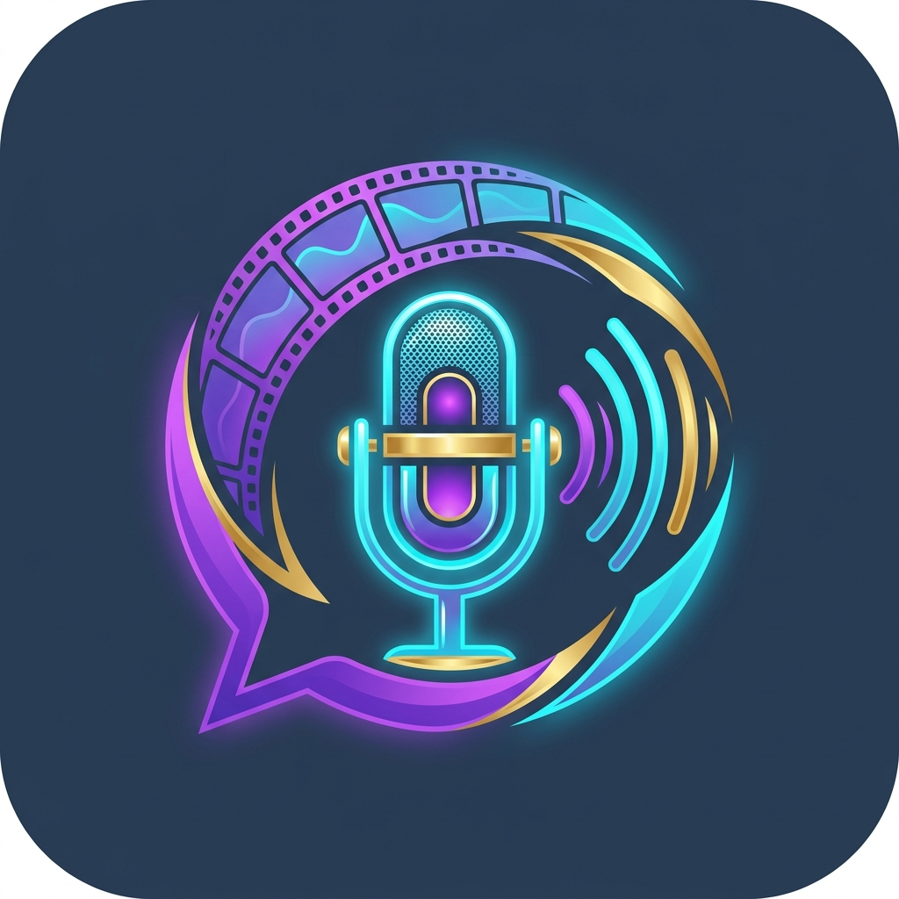
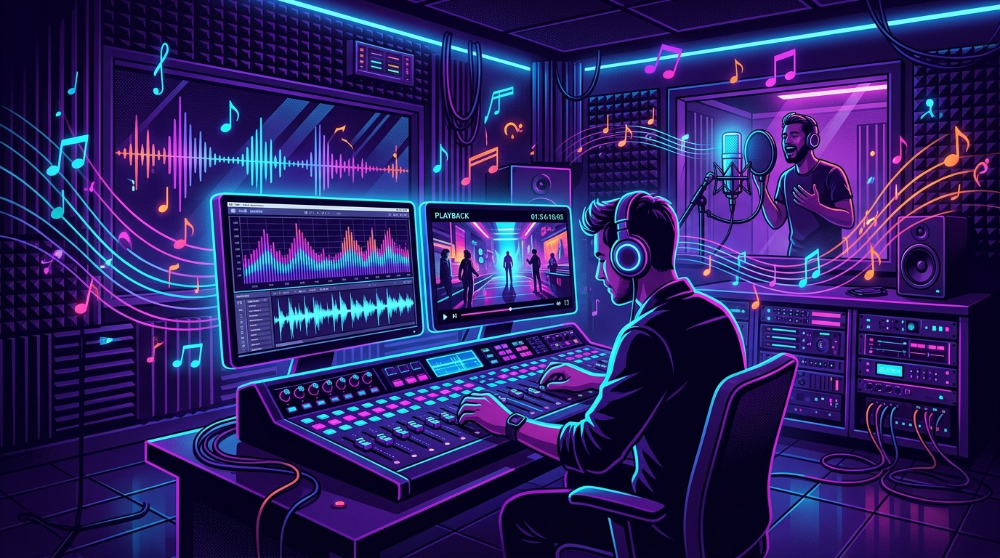
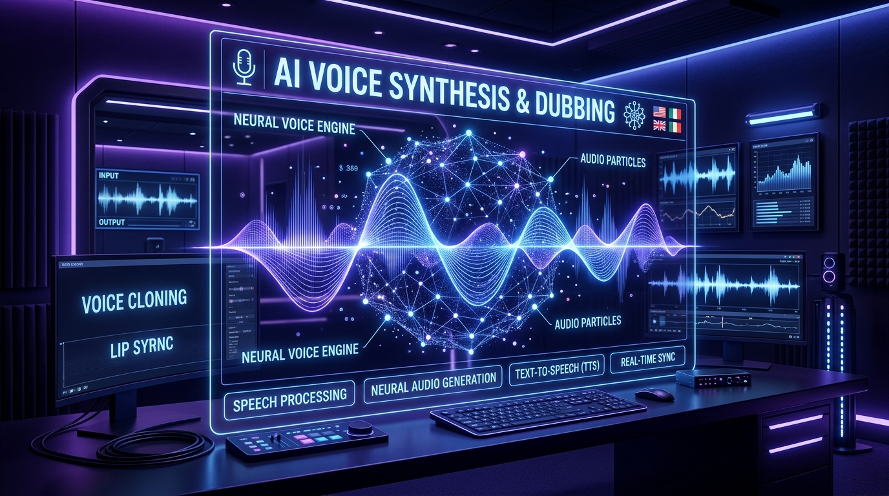
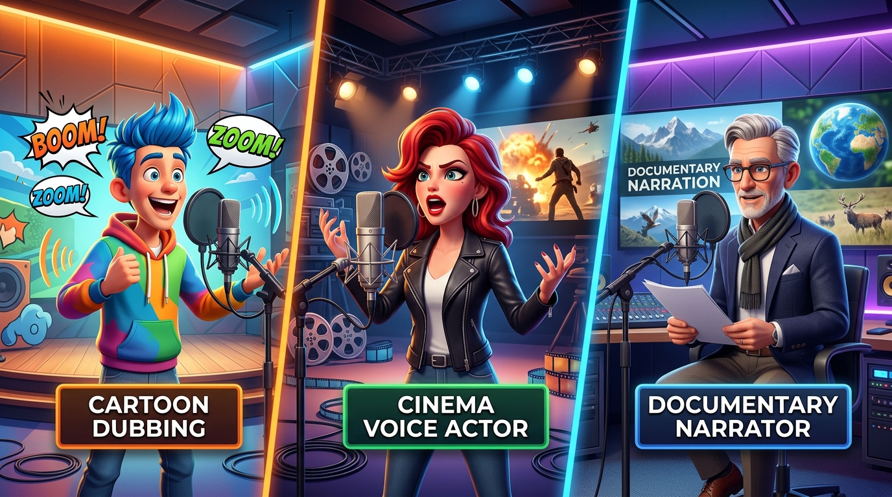

# VoiceMaster Pro | فويس ماستر برو 🎙️🎬
### المنصة السينمائية المتطورة لهندسة الصوت والدبلجة الآلية بالذكاء الاصطناعي بنظام أندرويد
### The Premier Cinematic Audio Engineering & Automated AI Dubbing Platform for Android

<p align="center">
  
</p>

<p align="center">
  
  
  
  
  
  
</p>

---

## 👑 حقوق الملكية الفكرية وبراءة الابتكار (Creator & Legal Ownership)

> ### **«محمد رضا محمود محمود سليمه من أسس هذا التطبيق»**
> 
> * **المؤسس، المبتكر والمهندس المعتمد:** محمد رضا محمود محمود سليمه (محمد سليمه)
> * **المكان والتوثيق:** فكريه
> * **سنة التأسيس والإصدار:** © 2026
> * **البريد الإلكتروني الرسمي:** `mahme98776@gmail.com`
> * **الحماية القانونية:** حفظ جميع الحقوق والملكية الفكرية وحقوق النشر للناشر محمد سليمه والمكان فكريه. يُحظر تماماً أي اقتباس، أو نسخ، أو تداول تجاري، أو تفكيك للشيفرات البرمجية أو الهندسة العكسية دون إذن كتابي رسمي ومسبق من صاحب الحقوق.

---

## 📸 معرض صور وشاشات التطبيق (Application Showcase)

<table align="center" width="100%">
  <tr>
    <td width="50%" align="center">
      <br/>
      <b>🎛️ استوديو هوليوود وهندسة الصوت متعدد المسارات (Multi-Track DAW)</b>
    </td>
    <td width="50%" align="center">
      <br/>
      <b>🧠 العقل الاصطناعي للدبلجة الذكية التلقائية بـ Gemini</b>
    </td>
  </tr>
  <tr>
    <td width="50%" align="center">
      <br/>
      <b>🎭 خامات الأصوات العالمية، اللهجات والتحكم في العمر الصوتي</b>
    </td>
    <td width="50%" align="center">
      <br/>
      <b>🗣️ المساعد الصوتي التفاعلي الذكي (Alexa & Gemini Assistant)</b>
    </td>
  </tr>
</table>

---

## 🌟 نظرة عامة على المشروع (Project Overview)

تطبيق **فويس ماستر برو (VoiceMaster Pro)** هو محطة عمل صوتية رقمية سينمائية فائقة التطور (**Cinematic Digital Audio Workstation - DAW**) مصممة خصيصاً لهواتف وأجهزة أندرويد لتمكين صناع الأفلام، واليوتيوبرز، والمدبلجين من إنتاج وتعديل ودبلجة مقاطع الفيديو والأصوات بجميع لغات العالم ولهجاتها تلقائياً بالذكاء الاصطناعي مع الحفاظ التام على جودة الصوت والمشاعر ومزامنة حركة الشفاه (Lip-Sync).

---

## ⚡ أبرز الخصائص والقدرات الفنية (Core Capabilities)

### 1. 🚀 الدبلجة التلقائية بضغطة زر واحدة (One-Click AI Dubbing & Lip-Sync)
- **تفريغ صوتي عالي الدقة (Speech-to-Text):** استخراج النص والترميز الزمني الملي ثانية (Timestamps).
- **الترجمة السياقية والدرامية:** ترجمة ذكية تفهم المعاني الثقافية والمجازية باستخدام نماذج Gemini (مع نظام التتالي التلقائي Cascading Models: 2.5 Flash / 2.0 Flash / 1.5 Flash / 3.5 Flash).
- **مزامنة حركة الشفاه (Temporal Lip-Sync):** تعديل سرعة ونبرة الكلام ومطابقتها زمنياً مع حركة فم الممثل في الفيديو دون إتلاف الترددات الصوتية.
- **توليد الأصوات بـ Neural TTS:** خامات صوتية طبيعية وبشرية 100% تدعم أكثر من 120 لغة ولهجة عالمية وعربية.

### 2. 🎛️ استوديو هوليوود لعزل المسارات الأربعة (Stem Separation DAW)
- **مسار الحوار البشري (Dialogue):** استخراج صوت المتحدثين بنقاء استوديو فائق.
- **مسار الموسيقى التصويرية (Music):** فصل الألحان والموسيقى التصويرية الأصلية.
- **مسار المؤثرات البيئية (SFX & Foley):** الاحتفاظ بأصوات الحركة والانفجارات والخطوات بدقة سينمائية.
- **مسار الضوضاء والبيئة (Ambience):** تنقية ذكية وإزالة صدى الصوت والتشويش.
- **محاكاة الميكروفونات العريقة (Microphone Emulation):**
  - Neumann U87 Ai
  - Shure SM7B
  - Abbey Road Vintage Tube Console
- **تغيير العمر الصوتي (Vocal Age Morphing):** تحويل الصوت بين طفل، شاب، رجل، وشيخ وقور مع الحفاظ على النبرة والمشاعر.

### 3. 🌐 الدبلجة الحية العائمة (ALAD Mobile Live Overlay Widget)
- نافذة عائمة على شاشة الهاتف تعمل كخدمة خلفية (`Foreground Service`) مع إمكانية دبلجة وترجمة أي فيديو أو تطبيق خارجي (مثل YouTube، TikTok، Instagram) أثناء تشغيله في الوقت الفعلي مع عرض نصوص الترجمة الفورية وعزل الصوت.

### 4. 🗣️ المساعد الصوتي التفاعلي المدمج (Alexa & Gemini Assistant)
- استماع للأوامر الصوتية باللغة العربية (باللهجات العامية والفصحى) وتنفيذ كافة إجراءات الاستوديو بدون لمس الهاتف.
- يدعم نطق التأكيدات الصوتية، قراءة الحالة للمكفوفين وضعاف البصر (Screen Reader Accessibility)، والتصحيح التلقائي للأوامر الشائعة.

### 5. 🛡️ منظومة الأمان والتحقق من حسابات الجهاز (Device-Bound Biometric Security)
- **التحقق من تواجد البريد على الجهاز (Device Account Verification):** ربط المصادقة بحسابات Google المسجلة على نفس الهاتف عبر واجهة أندرويد الرسمية (`AccountManager`) لمنع الدخول غير المصرح به.
- **تشفير عسكري AES-256-GCM:** تشفير المفاتيح والبيانات في مخزن العتاد الآمن (`Hardware Keystore`) بدون تخزين أي كلمات مرور بنص صريح.
- **الحماية ضد التخمين (Anti-Brute Force Lockout):** تعليق المحاولات الفاشلة مؤقتاً لحماية الحساب.
- **البصمة الصوتية غير المسموعة (Ultrasonic Acoustic Watermarking):** دمج توقيع رقمي خفي داخل ترددات الصوت لإثبات حقوق النشر والملكية للمطور والمستخدم.

### 6. 🎬 المعالجة العتادية بدون إعادة تشفير (Zero-Reencoding 4K Remuxing)
- دمج المسارات الصوتية الجديدة مع الفيديو عبر `MediaCodec` و `MediaMuxer` في ثوانٍ معدودة بدقة تصل إلى **4K Ultra HD** دون التأثير على جودة الصورة الأصلية وتوفير 85% من طاقة البطارية.

---

## 🛠️ البنية البرمجية والتقنيات (Architecture & Technology Stack)

| المجال | التقنية المستخدمة | التفاصيل |
| :--- | :--- | :--- |
| **لغة البرمجة** | Kotlin 2.0+ | Coroutines, StateFlow, Serialization, Clean Architecture |
| **واجهة المستخدم** | Jetpack Compose | Material Design 3, Dynamic Theming, Responsive Layouts |
| **معالجة الصوت والفيديو** | AndroidX Media3 & ExoPlayer | AudioTrack, MediaCodec NDK, MediaMuxer, Fast Remuxer |
| **الذكاء الاصطناعي** | Google Gemini API (REST) | Gemini 2.5 Flash, 2.0 Flash, 1.5 Flash, 3.5 Flash |
| **توليد الصوت** | Google Cloud Neural TTS | WaveNet, Neural Voices, Multi-lingual Dialects |
| **المصادقة والأمان** | AndroidX Biometric & Keystore | AES-256-GCM, PBKDF2, Fingerprint & Face Recognition |
| **قواعد البيانات** | Room Database & DataStore | KSP, Offline-First Architecture, Persistent Caching |
| **السحابية والتزامن** | Firebase Auth & Firestore | Cloud Sync, Profile Management, Action URL Verification |

---

## 📥 متطلبات التشغيل والبناء (Prerequisites & Build)

### المتطلبات الأساسية:
- **Android Studio:** إصدار Ladybug (2024.2.1) أو أحدث.
- **JDK:** OpenJDK 17 أو 21.
- **Android SDK:** الحد الأدنى Android 8.0 (API 26)، والمستهدف Android 14+ (API 34/35).

### خطوات تشغيل وبناء المشروع:

1. **استنساخ المستودع (Clone Repository):**
```bash
git clone https://github.com/mahme98776/VoiceMasterPro.git
cd VoiceMasterPro
```

2. **بناء وتوليد تطبيق APK التجريبي (Build Debug APK):**
```bash
gradle assembleDebug
```

3. **تشغيل الاختبارات البرمجية واختبارات Robolectric:**
```bash
gradle :app:testDebugUnitTest
```

---

## 📖 دليل الاستخدام الصحيح والكامل (Step-by-Step User Manual)

### الخطوة الأولى: إعداد مفتاح الذكاء الاصطناعي (Gemini API Setup)
1. افتح التطبيق واضغط على أيقونة المفتاح الذهبي في الشريط العلوي أو من قائمة الإعدادات.
2. الصق مفتاحك المستخرج من [Google AI Studio](https://aistudio.google.com/).
3. اضغط على **"فحص الاتصال الحي"** للتحقق من سرعة الاستجابة وصلاحية المفتاح.
4. اضغط على **"حفظ وتفعيل المفتاح"** — يقوم التطبيق بحفظ المفتاح مشفراً على جهازك فقط.

### الخطوة الثانية: تسجيل الدخول الآمن والمصادقة الحيوية
1. في صفحة الدخول، انقر على **"اختيار وتأكيد البريد من حسابات هذا الجهاز"** لاختيار بريدك الإلكتروني الموثق.
2. ستظهر شارة خضراء فورية تؤكد تطابق البريد مع حسابات الهاتف.
3. قم بتفعيل **"المصادقة ببصمة الإصبع أو الوجه"** للدخول الفوري السريع في المرات القادمة بأمان تام.

### الخطوة الثالثة: دبلجة مقطع فيديو بنقرة واحدة (One-Click Dubbing)
1. انتقل إلى تبويب **"الدبلجة بالذكاء الاصطناعي"** (AI Dubbing).
2. اختر مقطع فيديو من الاستوديو أو استورد رابط فيديو.
3. حدد اللغة المستهدفة (مثلاً: العربية، الإنجليزية، الفرنسية، الإسبانية، التركية، الألمانية، إلخ) واللهجة المطلوبة.
4. حدد النبرة الصوتية والشخصية (سينمائي، وثائقي، مرح، حماسي، طفل، درامي).
5. اضغط على زر **"دبلجة المشهد بضغطة زر 🚀"**.
6. سيقوم التطبيق بتفريغ الصوت، عزل المسارات، الترجمة، المزامنة مع الشفاه، وتركيب الصوت الجديد تلقائياً.

### الخطوة الرابعة: استخدام المساعد الصوتي الذكي (Alexa & Gemini)
1. اضغط على أيقونة الميكروفون المضيئة في أسفل الشاشة أو في القائمة.
2. تحدث بالأمر الصوتي الطبيعي، مثل:
   - *"دبلج المشهد الحالي باللغة الإنجليزية"*
   - *"شغل الفيديو وعلي الصوت"*
   - *"افصل الموسيقى عن صوت الكلام"*
   - *"نظف الصوت وشيل الصدى"*
3. سيقوم المساعد بتنفيذ الأمر صوتياً وتقديم رد مسموع يؤكد نجاح العملية.

### الخطوة الخامسة: استخدام الويدجت العائم (ALAD Live Overlay)
1. من الشاشة الرئيسية، قم بتفعيل ميزة **"الدبلجة الحية العائمة (ALAD)"**.
2. اسمح بإذن الظهور فوق التطبيقات الأخرى.
3. افتح أي تطبيق خارجي (يوتيوب أو تيك توك) واضغط على الأيقونة العائمة لتفعيل الترجمة والدبلجة الفورية في الخلفية.

### الخطوة السادسة: تصدير ومشاركة الإنتاج الصوتي
1. من شاشة الاستوديو، انقر على **"تصدير الدبلجة"**.
2. اختر صيغة الإخراج (فيديو مدمج بدقة 4K بدون إعادة تشفير، أو ملف صوتي منفصل WAV عالي الجودة 44.1kHz، أو ملف ترجمة متزامن SRT/VTT).
3. احفظ الملف في مجلد مشاريعك أو شاركه مباشرة عبر وسائل التواصل.

---

## 🔒 الأمان والخصوصية وحماية البيانات (Privacy & Security Notice)

- **حفظ السرية التامة:** لا يتم إرسال أي تسجيلات صوتية أو وسائط شخصية إلى خوادم خارجية غير موثوقة.
- **التخزين المحلي الآمن:** يتم حفظ كافة الإعدادات والمفاتيح والمشاريع في قاعدة بيانات محلية مشفرة على هاتف المستخدم.
- **حقوق النشر والعلامة المائية:** تتضمن المعالجة تقنية البصمة الصوتية التشفيرية المعتمدة لحفظ ملكية المحتوى للمطور **محمد سليمه** وللمستخدمين المرخصين.

---

## 📜 الترخيص والدعم الفني (License & Support)

جميع حقوق البرمجة والتصميم والتنفيذ محفوظة بالكامل للأستاذ **محمد رضا محمود محمود سليمه من أسس هذا التطبيق** © 2026.

- **للاستفسارات والترخيص الرسمي:** `mahme98776@gmail.com`
- **المقر والتوثيق:** فكريه
